# DISMATH_ProjectBonus_FaeSerrano

#Design Screenshots
##Design for Screen1
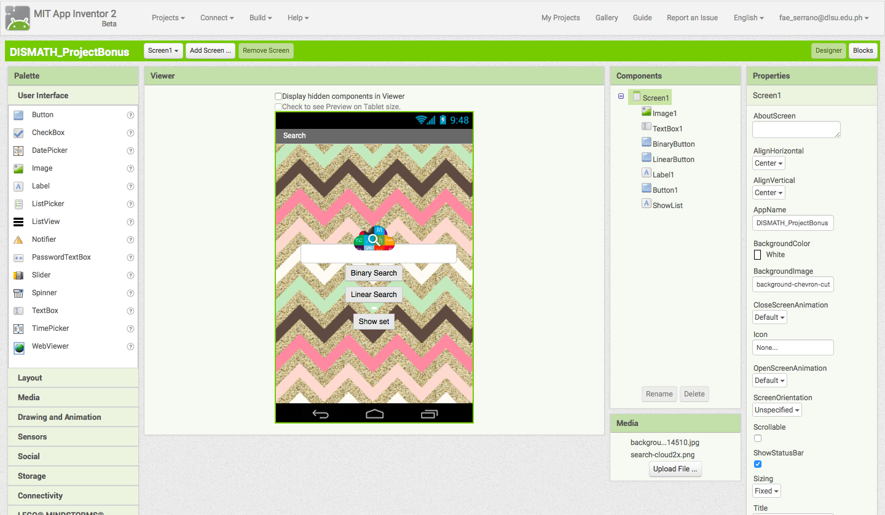
  

#Block Screenshots
##Blocks for creating the list and button functions
 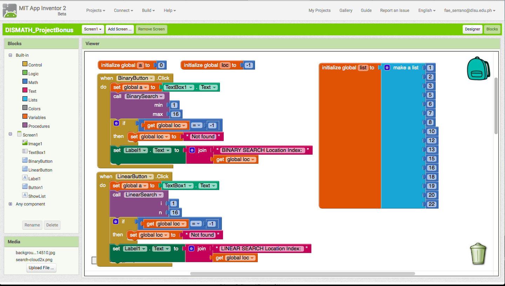
  
##Blocks for LINEAR SEARCH
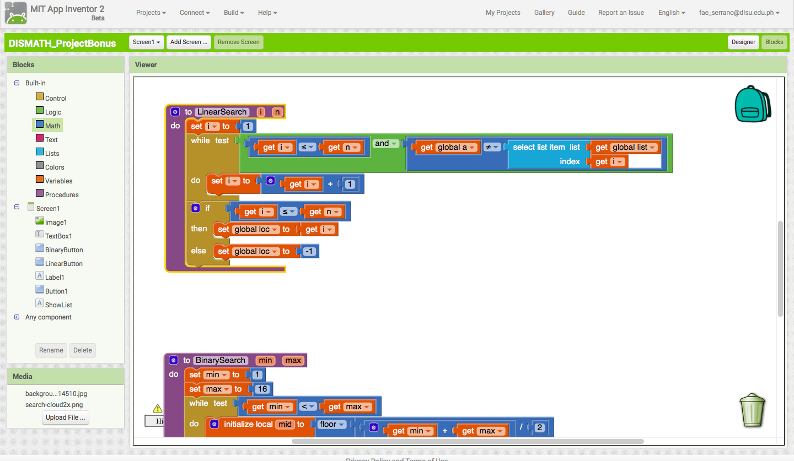
  
##Blocks for BINARY SEARCH
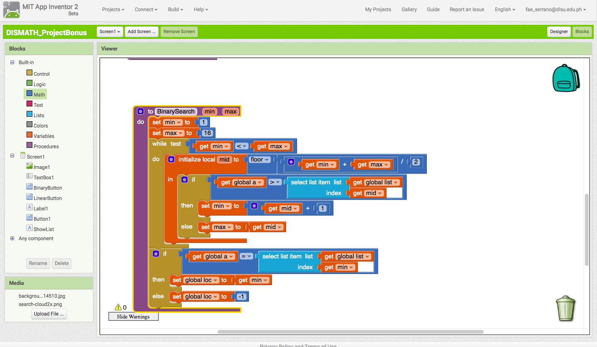
  
##Blocks for showing the list
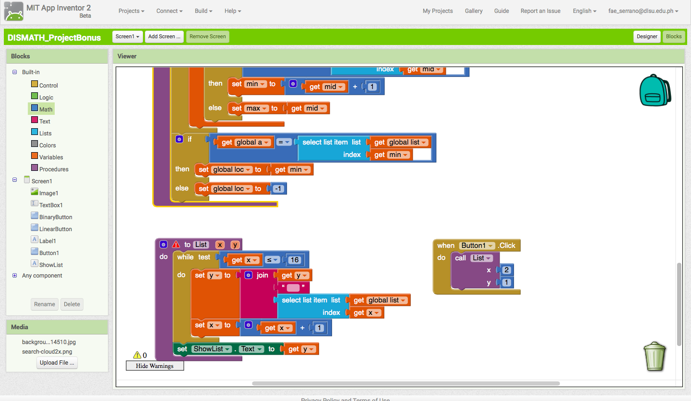
  

#Emulator Screenshots
##When the app was launched 
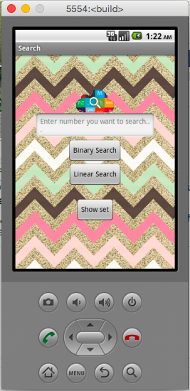
  
##When Show set button was pressed 
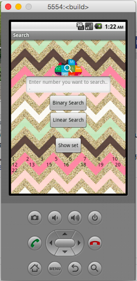
  
##USING BINARY SEARCH 
###Trial 1: Search for 12. Found 
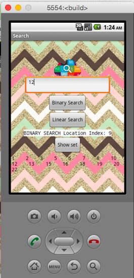
  
###Trail 2: Search for 100. Not found 
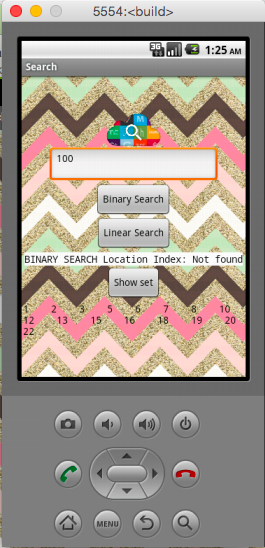
  
##USING LINEAR SEARCH 
###Trial 1: Search for 12. Found 
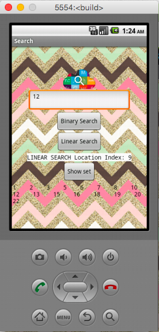
  
### Trail 2: Search for 123. Not found 
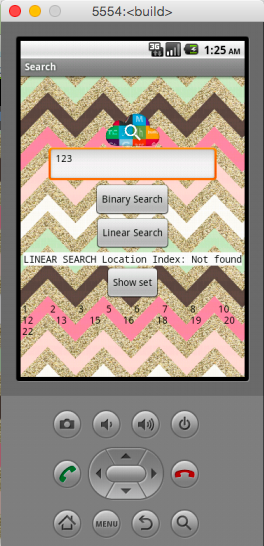
